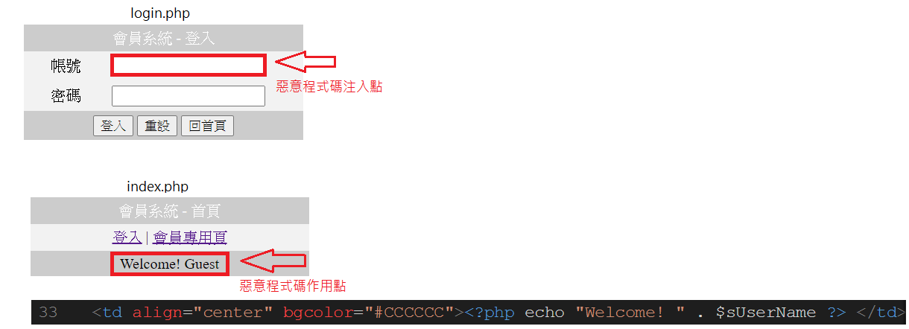
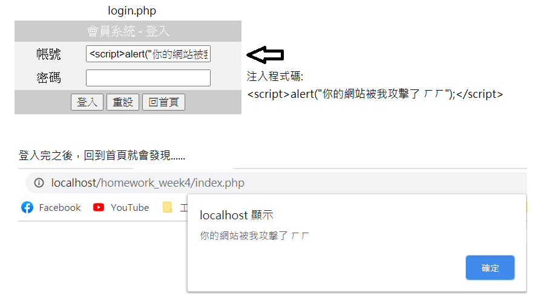
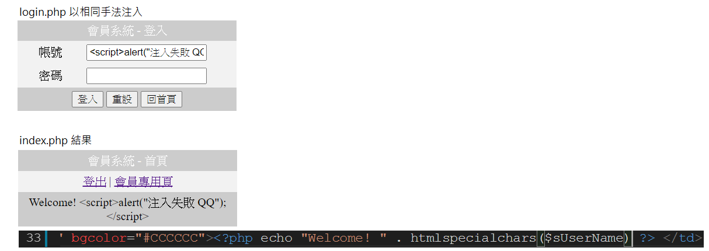

# homework_week4

* 作業描述: 將上課登入網站範例以session方式改寫。
* 額外補強: 此網站會被XSS攻擊，所以做了額外的補強。

被攻擊的位置如下圖:

由於index.php第33行程式碼直接將從使用者輸入的帳號所得到的字串直接貼在html文件中，這樣可以直接將javascript程式碼注入到原本的html文件上並執行。示範過程如下:

補強方法是將index.php第33行的程式碼將變數$sUserName用htmlspecialchars進行特殊字元轉換，這樣就可以避免被XSS攻擊了。

